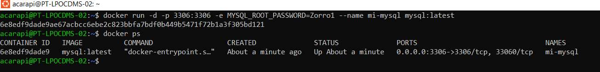
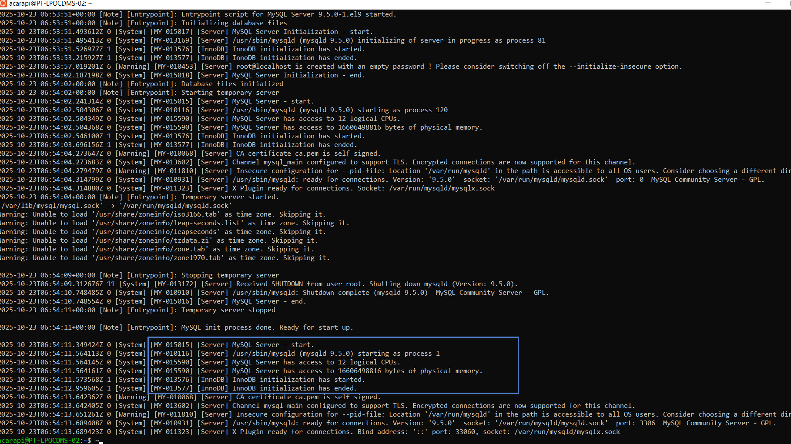
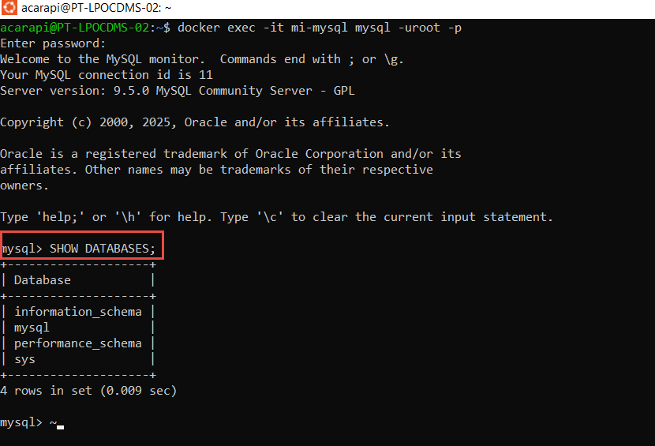
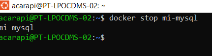
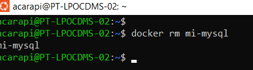
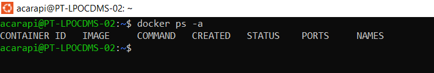

# Clase 1 - Introducción a Containers y Docker

## Objetivo

Practicar el despliegue de diferentes tipos de aplicaciones usando `docker run` y documentar el proceso de cada una.

#### Opción 3: MySQL (base de datos relacional)

Despliega un servidor MySQL:
- Imagen: `mysql`
- Puerto: 3306
- Nombre del container: `mi-mysql`
- Variables de entorno requeridas:
  - `MYSQL_ROOT_PASSWORD=mi-password-seguro`
- Verifica con `docker logs` que MySQL inició correctamente

### Tareas a Realizar

Para la aplicación que elegiste:

1. **Ejecutar el container** en segundo plano con el puerto y nombre especificados

2. **Verificar que funciona:**
   - Lista los containers en ejecución
   - Consulta los logs del container
   - Accede al servicio (navegador para httpd, logs para redis/mysql)

3. **Limpieza:**
   - Detén el container
   - Elimínalo
   - Verifica que ya no existe

---


## Desarrollo

### 1. Ejecutar el container

```bash
docker run -d -p 3306:3306 -e MYSQL_ROOT_PASSWORD=Zorro1 --name mi-mysql mysql:latest
```

**Explicación:** 
Este comando
- `docker run` → Crea y ejecuta un container 
- `-d` → Aplicar en segundo plano 
- `-p 3306:3306` → Publica el mapeo del puerto 3306 de mi máquina al puerto 3306 del container 
- `-e MYSQL_ROOT_PASSWORD=Zorro1`
- `-e` → Significa environment variable (variable de entorno)
- `MYSQL_ROOT_PASSWORD=Zorro1` → Le dice al contenedor cuál será la contraseña del usuario root, es obligatoria para MySQL
- `--name mi-mysql`
- `--name` → Asigna un nombre personalizado al contenedor en este caso el nombre de mi-mysql
- `mysql:latest`
- `mysql` → Nombre del repositorio (imagen oficial de MySQL en Docker Hub)
- `:latest` → Indica que se use la versión más reciente (por defecto)

**Salida:**
```
6e8edf9dade9ae67acbcc6ebe2c823bbfa7bdf0b449b5471f72b1a3f305bd121
```

### 2. Verificar que está corriendo

**- Lista los containers en ejecución**

```bash
docker ps
```

**Screenshot:**



**- Consulta los logs del container**

```bash
docker logs mi-mysql
```

**Screenshot:**



**- Accediendo al servicio**

```bash
docker exec -it mi-mysql mysql -uroot -p
```

**Screenshot: En este caso nos pedira la contraseña que definimos para root y dentro podemos ver (SHOW DATABASES;) para salir exit**



### 3. Limpiar

**- Deteniendo el container**

```bash
docker stop mi-mysql
```

**Screenshot:**



**- Eliminando el container**

```bash
docker rm mi-mysql
```

**Screenshot:**



**- Verificando que ya no existe el container**

```bash
docker ps -a
```

**Screenshot:**



## Conclusiones

Aprendí a ejecutar containers en segundo plano y mapear puertos.