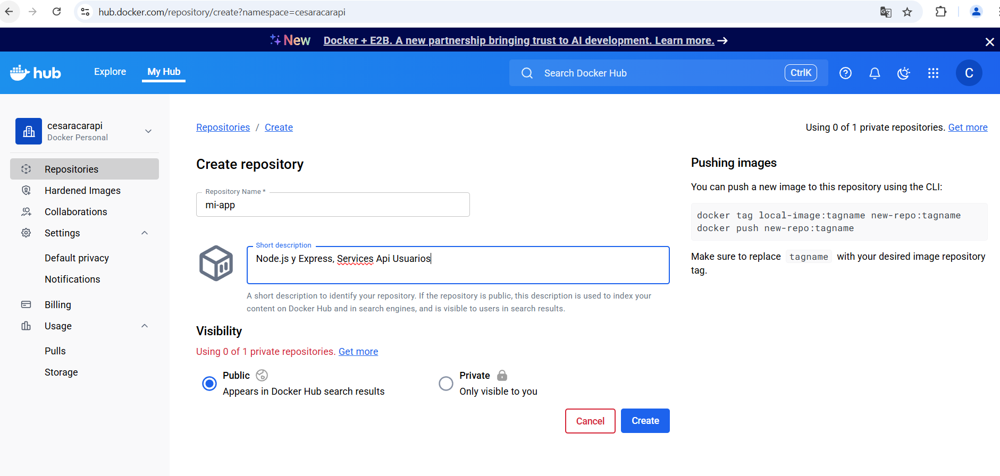
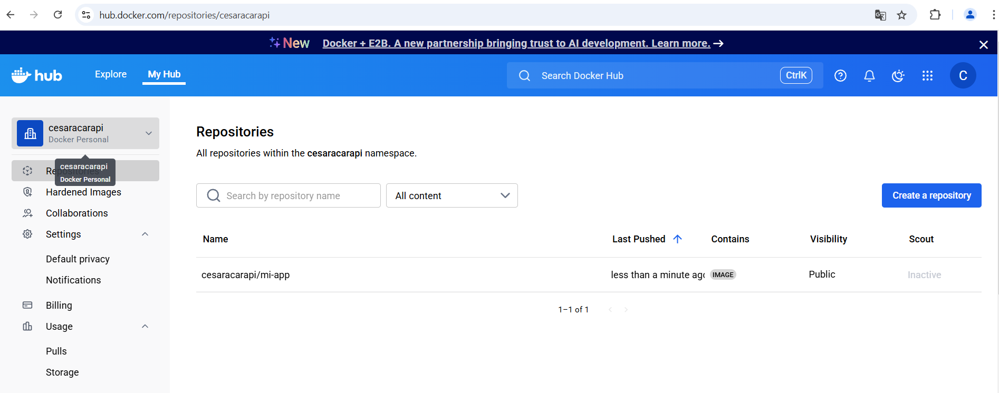

# Tarea 2 - Dockerización de Mi Aplicación

## 1. Descripcion de la Aplicación

**Lenguaje:** Node.js  
**Framework:** Express  
**Descripción:** API REST para listar usuarios / mostrar informacion de usuarios 

**EndPoints:**  
- GET / - Página de bienvenida  
- GET **/api/listado_usuarios** - Listado de usuarios
- GET **/api/usuario/:id** - Información de usuario por Id

**Funcionalidad básica**


## 2. Dockerfile

```
# -------- STAGE 1: Build --------
FROM node:18-alpine AS builder

# Crear directorio de trabajo
WORKDIR /app

# Copiar archivos necesarios
COPY package*.json ./

# Instalar solo dependencias necesarias para build
RUN npm install --only=production

# Copiar el resto del código
COPY . .

# -------- STAGE 2: Producción --------
FROM node:18-alpine

# Crear usuario no-root
RUN addgroup -S appgroup && adduser -S appuser -G appgroup

# Crear directorio de trabajo
WORKDIR /app

# Copiar solo lo necesario desde el builder
COPY --from=builder /app /app

# Usar solo dependencias de producción
ENV NODE_ENV=production

# Puerto configurable (por defecto 3000)
ENV PORT=3000

# Exponer el puerto (documentado)
EXPOSE 3000

# Metadata
LABEL maintainer="Cesar Alejandro Acarapi Calderon"
LABEL org.opencontainers.image.source="https://github.com/CesarAcarapi1991/opcion1-node.git"
LABEL org.opencontainers.image.description="Aplicación Node.js con Express optimizada para producción"

# Healthcheck (opcional pero recomendado)
HEALTHCHECK --interval=30s --timeout=10s --start-period=5s --retries=3 \
  CMD wget --no-verbose --tries=1 --spider http://localhost:$PORT/ || exit 1

# Cambiar a usuario no-root
USER appuser

# Comando de inicio
CMD ["node", "index.js"]
```

### Stage 1: Build
```
# -------- STAGE 1: Build --------
FROM node:18-alpine AS builder

# Crear directorio de trabajo
WORKDIR /app

# Copiar archivos necesarios
COPY package*.json ./

# Instalar solo dependencias necesarias para build
RUN npm install --only=production

# Copiar el resto del código
COPY . .
```
Este bloque:  
- Crea un contenedor con Node 18  
- Copia tu proyecto  
- Instala dependencias necesarias para producción  
- Prepara todo para la siguiente fase (generalmente build o empaquetado)
### Stage 2: Production
```
# -------- STAGE 2: Producción --------
FROM node:18-alpine

# Crear usuario no-root
RUN addgroup -S appgroup && adduser -S appuser -G appgroup

# Crear directorio de trabajo
WORKDIR /app

# Copiar solo lo necesario desde el builder
COPY --from=builder /app /app
```
Este bloque:
- Hace la imagen final más liviana, copiando solo lo necesario  
- Mantiene buena seguridad usando usuario no-root  
- Solo contiene el runtime para ejecutar la aplicación (no herramientas extra)

**Explicación:**

| Stage | Propósito |
|-------|-----------|
| Build | Instalar todas las dependencias necesarias, copiar el código fuente, generar el build de la aplicación y preparar artefactos listos para producción. También permite optimizar usando caché y no incluir herramientas o archivos innecesarios en la imagen final. |
| Production | Crea una imagen ligera y segura para ejecutar la aplicación. Solo contiene el código generado y las dependencias mínimas necesarias para correr en producción. Reduce tamaño, mejora seguridad y evita incluir toolchains de compilación. |

## 3. Proceso de Build

### Comandos Ejecutados
```
# Construir la imagen docker
docker build -t mi-app:1.0 .  

# Verificación de la imagen creada
docker images
```

### Salida del Build(primeras y últimas líneas)


### Tamaño final de la imagen
```
# Verificación el tamaño de la imagen
docker images
```

## 4. Testing Local
### Comandos para ejecutar el contanier
```
# Ejecutador el contenedor
docker run -d -p 3000:3000 --name mi-app mi-app:1.0
```
### Screenshots de:

- `docker images`  
- `docker ps`  
- `Navegador o curl` probando los EndPoints  
- `docker logs`  


## 5. Publicación de Docker Hub
### Crear el repositorio en DockerHub


### Comandos de tag y push
```
docker tag mi-app:1.0 cesaracarapi/mi-app:1.0

docker push cesaracarapi/mi-app:1.0
```
  

### URL pública de la imagen de Docker Hub
```
https://hub.docker.com/r/cesaracarapi/mi-app
```
### Screenshot de la página de Docker Hub

## 6. Optimizaciones Aplicadas
### Comparación de tamaños
En este caso se uso multi-stage y los tamaños son los mismos
```
docker images
```
### Capas de la imagen(`docker history`)
```
docker history cesaracarapi/mi-app:1.0
```

## 7. Conclusiones
### Dificultades encontradas
- Falta de practica para el dominio
- Tiempo comprometido por el ambito de trabajo
### Qué aprendiste
- Manejo de Dockerfile y stage
- Publicación de imagen en hub.docker.com
### Diferencias con Clase 1
- Mejor control con el manejo de las imagen respecto a los comandos